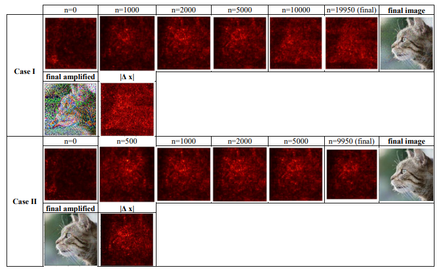
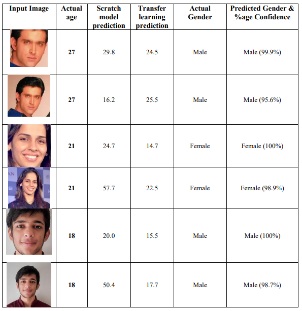
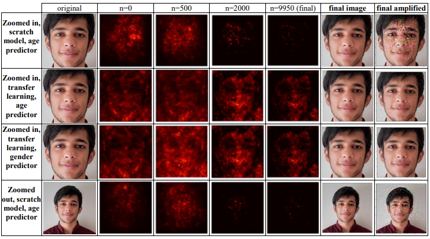

# De-Agify

This project explores the effect of black box and white box adversarial attacks on different convolutional neural network architectures, like pre-trained models fine-tuned with learning transfer and models trained from scratch, with tasks of: classifying objects in images;
predicting the age of a person in a given image; predicting the gender of a person in a given image

[Link to the findings paper](https://drive.google.com/file/d/1RaUmklPVAMOUb16fmU1dJkbKJ4W5fIIz/view?usp=share_link)

## Set up the project
Install Python 3.9.x and download the aligned and cropped faces from the UTK Face dataset [from here](https://drive.google.com/drive/folders/0BxYys69jI14kU0I1YUQyY1ZDRUE?resourcekey=0-01Pth1hq20K4kuGVkp3oBw). Extract it into a folder named UTKFace

From the terminal run the following:
- `pip3 install requirements.txt`
- `python3 create_data.py`

## Reproduce findings
- Train all models by running all cells in `learning_transfer.ipynb` and `learning_transfer_gender.ipynb`. Use the `predict(url)` functions to use the models to use the model on some of your own images.
- You can save the models for the adversarial attack step
(note: you can increase the number of `divs` in `create_data.py` if the generated data file does not fit in your system's memory)
- Load the appropriate model as `base_model` in `adversarial_attack.ipynb`
- Choose your training images in `original_img` and `target_img` and run all cells

## Findings
**ImageNet dataset**

  
**Personal dataset results**

  
**Personal dataset gradients**

  
The complete record of changes in the dataset/model architecture/learning techniques used can be seen at [this Google Doc](https://docs.google.com/document/d/1eF0cUl0fvmg4Zk7Ej1xws9iGObedpPTzDhYCx79zp9I)
